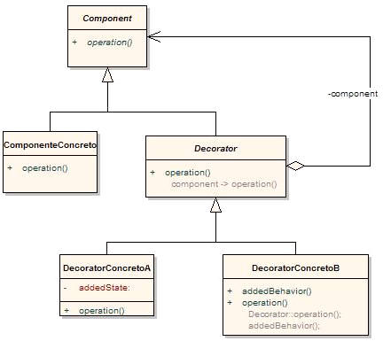
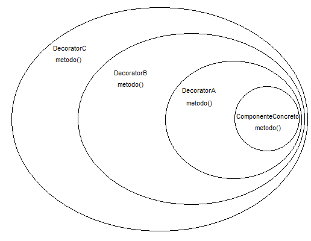

# Patron
<h1>Patrones Decorator</h1>

<h3>Creado por :</h3>

<ul> 
<li> Juan Bautista Penalva Perez </li>
<li> Francesc Bernabeu Agulló </li>
<li> Mikel Mendoza Rubio </li>
                          
<h3>Decorador</h3>

Sirve para añadir ciertas responsabilidades a objetos de una forma dinamica. Tambien conocido como Wrapper.
Nos permite añadir resposabilidades a un objeto sin necesidad de hacerlo a toda la clase. Se pueden añadir por medio de herencia pero no es flexible. La mejor solución es rodear el objeto con otro objeto que es el que añade la nueva responsabilidad. Este nuevo es el decorador.

